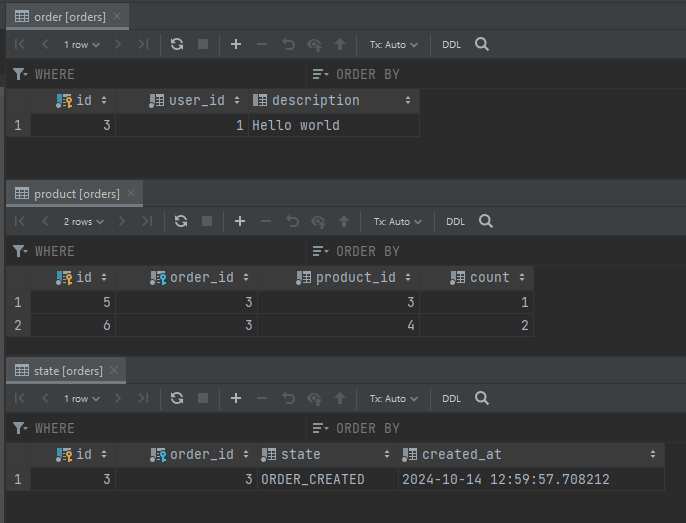

## Saga: Сервис заказов Orders
---

### Описание сервиса
Сервис позволяет создавать и получать заказы.

### Database scheme


### Структура кода
- api - хранится прото файл
- bin - хранятся бинарники
- cmd/
    - productcons - запуск консьюмера, принимающий сообщения по резервам (CREATED, FAILED), создающий state для заказа
    - paymentcons - запуск консьюмера, принимающий сообщения по оплате (CREATED, FAILED, COMPLETED), создающий state для заказа
    - server - запуск сервера с апи и задачами по отправке эвентов по заказу
- migrations - сами миграции
- config - конфигурация по энвам
- internal/
    - app/
        - consumers/handlers/
            - product
            - payment
        - cron
        - server
    - clients/
        - kafka/
            - consumer/ - консьюмер
            - producer/ - продюсер
      - redis/
    - errs - общие ошибки
    - services/ - бизнес слой
        - product
        - system 
    - storage - слой данных
        - db - подключение к бд
        - repo/ - репозитории
            - order/ - репозиторий заказов
            - state/ - репозиторий стейта заказов

### Деплой и прочие нюансы
#### Руководство по запуску
##### Вариант с созданием виртуального окружения
[docker](https://www.docker.com "популярный контейнизатор")

1. Запускаете команду из Makefile, которая поднимает все контейнеры из docker-compose и запускает миграции:

   ```make up```

##### Debug приложения.

1. Открываем клиент, высылаем сообщение по заказу: 
    ```json
   {
    "order_products": [
      {
        "product_id": 3,
        "count": 1
      },
      {
        "product_id": 4,
        "count": 2
      }
    ],
    "user_id": 1,
    "description": "Hello world"
    }
   ```
   Увидим, что в связанных таблицах появились записи (заказ в order, продукты в products, статус заказа в state)
   
   Также увидим, что появилось сообщение в топике Order о создании заказа.
   ```json
      {
        "idempotent_key": "9fd39982-b2bb-4d0e-bf6a-06c8411d6d70",
        "order_id": 3,
        "status": "CREATED"
      }
   ```
2. Зайдите в [kafka-ui](http://localhost:8080/), увидите 3 топика **order**, **payment** и **reserve**
3. Сымитируем ошибку резерва, отправим в топик **reserve** сообщение:
    ```json
        {
          "idempotent_key": "d978c560-fdba-4e84-b3f1-b570d8d95e4c",
          "order_id": 3,
          "status": "FAILED"
        }
    ```
   Увидим, что в state добавился **RESERVE_FAILED** 
4. Сделаем тоже самое, но вышлем сообщение об успешном резерве 
    ```json
        {
          "idempotent_key": "d978c560-fdba-4e84-b3f1-b570d8d95e4c",
          "order_id": 4,
          "status": "CREATED"
        }
    ```
   Увидим state **RESERVE_CREATED**
5. Payment consumer принимает 3 статуса CREATED/FAILED/COMPLETED.

    Проделаем аналогичные действия и увидим изменения стейта заказа.
    Для чего это нужно? - поможет проследить маршрут заказа по сервису (в каком статусе и когда).
    А также даст понять, что его нужно или не имеет смысла оплачивать.

    Цепочки событий могут быть такими:
    **ORDER_CREATED -> RESERVE_CREATED -> PAYMENT_CREATED -> PAYMENT_COMPLETED**
    
    **ORDER_CREATED -> RESERVE_CREATED -> PAYMENT_CREATED -> PAYMENT_FAILED**
    
    **ORDER_CREATED -> RESERVE_CREATED -> PAYMENT_FAILED**
    
    **ORDER_CREATED -> RESERVE_FAILED**

6. Апи сервера:
 - create_order 
 - get_order 
 - get_orders 

#### Полезные команды
1. kafka-ui
http://localhost:8080/
2. логи докер
docker logs -f orders-orders-productcons-1
docker logs -f orders-orders-paymentcons-1
docker logs -f orders-orders-api-1
3. консоль redis  
redis-cli
