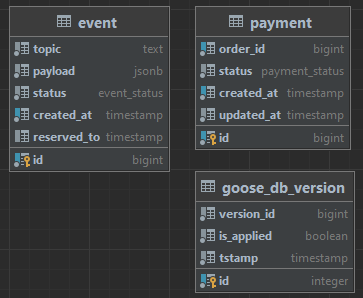
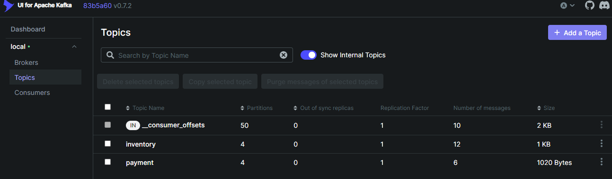
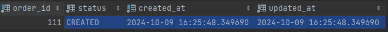
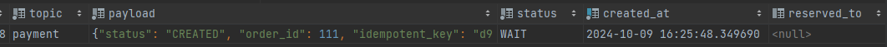
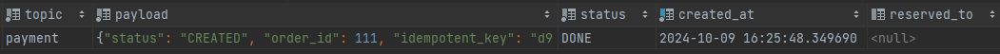
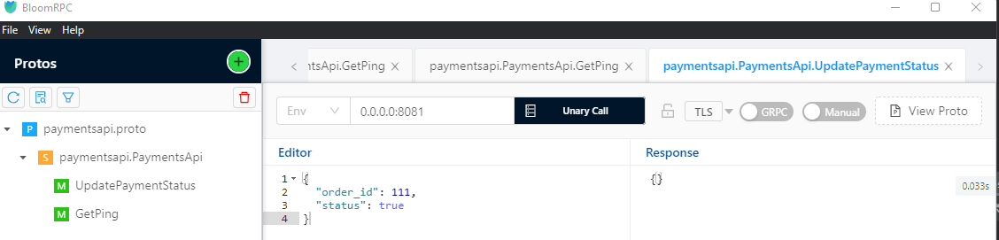

## Saga: Сервис оплаты Payments
---

### Описание сервиса
Сервис позволяет создавать и изменять статус оплаты.

### Database scheme


### Структура кода
- api - хранится прото файл
- bin - хранятся бинарники
- cmd/
    - consumer - запуск консьюмера, принимающим сообщения по инвентаризации заказа
    - server - запуск сервера с апи и задачами по отправке эвентов по платежу
- migrations - сами миграции
- config - конфигурация по энвам
- internal/
    - app/
        - consumer
        - cron
        - server
    - clients/
        - kafka/
            - producer/ - консьюмер
            - producer/ - продюсер
      - redis/
    - errs - общие ошибки
    - services/ - бизнес слой
        - payment
        - system 
    - storage - слой данных
        - db - подключение к бд
        - repo/ - репозитории
            - payment - репозиторий платежей

### Деплой и прочие нюансы
#### Руководство по запуску
##### Вариант с созданием виртуального окружения
[docker](https://www.docker.com "популярный контейнизатор")

1. Запускаете команду из Makefile, которая поднимает все контейнеры из docker-compose и запускает миграции:

   ```make up```

##### Debug приложения.

1. Зайдите в [kafka-ui](http://localhost:8080/), увидите 2 топика **inventory** и **payment**.


2. Сообщение о зарезервированном заказе.
    - Пушим сообщение в топик **inventory**, пример сообщения:
      ```json
      {
        "idempotent_key": "d978c560-fdba-4e84-b3f1-b570d8d95e4c",
        "order_id": 111,
        "status": "COMPLETED"
      }
      ```
    Необходимо на этом моменте оставить пару комментариев:

    Это сообщение заберет консьюмер приложения, статусы могут меняться, но заберет оно именно **status=СOMPLETED**,
    что скажет о завершении резервирования;

    **idempotent_key** - ключ идемподентности нужен для понимания дубль это или нет - храним в **redis**.
    После пуша сообщения увидим создание в таблице **payment** строчки со статусом **CREATED**
    и в таблице **events** строчки со статусом **WAIT** (если сразу же получить записи)
    
    
    Если еще раз обновить стейт таблицы **event** - статус поменяется на **Done**, значит, что наш
    паттерн **transactional outbox** отработал и сообщение о том, что счет на оплату создан улетело в топик **payment**
    Можем заметить поле **reserved_to** - оно необходимо для обработки залипших записей.
    

3. Оплачиваем/не оплачиваем заказ через api:
    
    В таблице **payment** статус поменяется на **COMPLETED**, а в таблице **event** по аналогии появится новое сообщение на отправку.
    Использую довольно простой клиент, но он с 2021 года не обслуживается [bloomrpc](https://github.com/bloomrpc/bloomrpc/releases)

#### Полезные команды
1. kafka-ui
http://localhost:8080/
консоль
kafkacat -C -b localhost:9095 -t payment
kafkacat -C -b localhost:9095 -t inventory

2. консоль redis  
telnet localhost 6379
