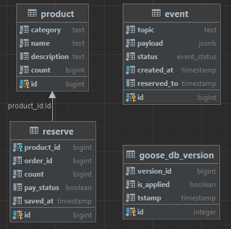

## Saga: Сервис товаров Products
---

### Описание сервиса
Сервис позволяет получать товары и резервировать.

### Database scheme


### Структура кода
- api - хранится прото файл
- bin - хранятся бинарники
- cmd/
    - ordercons - запуск консьюмера, принимающий сообщения по заказам (CREATED), резервирующий товар и создающий эвенты (CREATED, FAILED)
    - paymentcons - запуск консьюмера, принимающий сообщения по оплате (FAILED, COMPLETED)
    - server - запуск сервера с апи и задачами по отправке эвентов по платежу
- migrations - сами миграции
- config - конфигурация по энвам
- internal/
    - app/
        - consumers/handlers/
            - order
            - payment
        - cron
        - server
    - clients/
        - kafka/
            - producer/ - консьюмер
            - producer/ - продюсер
      - redis/
    - errs - общие ошибки
    - services/ - бизнес слой
        - product
        - system 
    - storage - слой данных
        - db - подключение к бд
        - repo/ - репозитории
            - product - репозиторий платежей

### Деплой и прочие нюансы
#### Руководство по запуску
##### Вариант с созданием виртуального окружения
[docker](https://www.docker.com "популярный контейнизатор")

1. Запускаете команду из Makefile, которая поднимает все контейнеры из docker-compose и запускает миграции:

   ```make up```

##### Debug приложения.

1. Зайдите в [kafka-ui](http://localhost:8080/), увидите 2 топика **order** и **payment**.


2. Сообщение о созданном заказе. Пушим сообщение в топик **order**, пример сообщения:
    ```json
      {
        "idempotent_key": "d978c560-fdba-4e84-b3f1-b570d8d95e4c",
        "order_id": 111,
        "status": "CREATED"
      }
      ```
      Увидим создание резервов и уменьшение продуктов (count); 
      Еще появится эвент об удачном резерве или неудачном в топике **inventory** (CREATED/FAILED)

3. После создания резервов зафиксируем их. Для этого пушанем в топик **payment** об оплате заказа:
    ```json
    {
    "idempotent_key": "d978c560-fdba-4e84-b3f1-b570d8d95b4c",
    "order_id": 111,
    "status": "COMPLETED"
    }
    ```
   увидим, что статус резерва изменился на true

4. Теперь проведем ситуацию, когда фейлится оплата, для этого необходимо повторить действие в пункте 2, только с order_id = 222.
Далее отправить сообщение в topic **payment** со статусом **FAILED**
   ```json
   {
   "idempotent_key": "d978c560-fdba-4e84-b3f1-b590d8d95b4c",
   "order_id": 222,
   "status": "FAILED"
   }
   ```
   Увидим, что продукты вернулись, а статус в резервах стал false
   


#### Полезные команды
1. kafka-ui
http://localhost:8080/
консоль
kafkacat -C -b localhost:9095 -t payment
kafkacat -C -b localhost:9095 -t inventory
2. логи
docker logs products-products-ordercons-1 -f
docker logs -f products-products-paymentcons-1
docker logs -f products-products-api-1
3. консоль redis  
redis-cli
